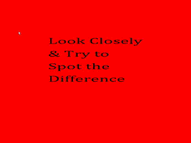
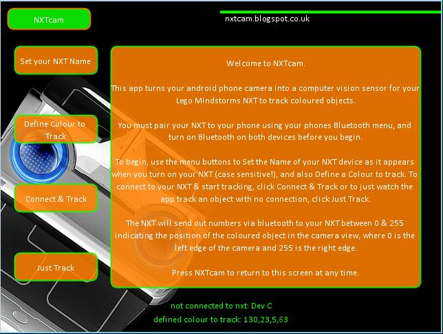
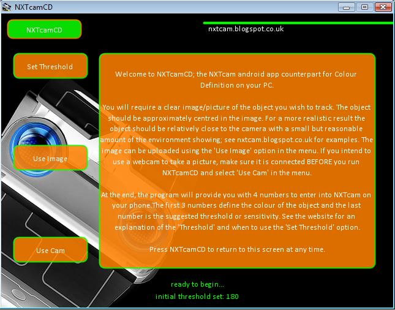

# Legacy LEGO MATLAB and Processing Projects

Legacy projects written in [MATLAB](https://www.mathworks.com/products/matlab.html) and [Processing](https://processing.org); a language built on Java. When these projects were developed, the Processing language had a framework for developing desktop Java applications (Processing Java) and mobile phone Android applications (Processing Android).

This repository is a collection of legacy projects (created between 2008 and 2013), some of which were created as counterpart programs for the projects in the [JM-legacy-lego-mindstorms-nxt-c-projects repository](https://github.com/jo3-tech/JM-legacy-lego-mindstorms-nxt-c-projects).

Similar to the aforementioned repository, these projects were early-stage prototypes and were never fully finalised. All code, documentation, and descriptions were originally written over a decade ago and have been copied here with only minor modification. As such, they may lack polish, clarity, or completeness, and do not reflect current best practices.

Android installation package (.apk) files for the [look-closely-android](look-closely-android) and [NXTcam-android](NXTcam-android) projects can be found in the [builds](builds) folder, and (at the time of writing) are still installable and usable on the latest version of Android.

## look-closely

This project is written in the Processing (Java and Android) language. The aim of this project was to create a screamer/jump-scare game, which tricks you into playing "spot the difference" by asking you to look closely at two similar images (the decoy) in an attempt to find a difference between (there isn't any), then suddenly shows a pop-up of a scary image accompanied by a loud shriek (the punchline).



### look-closely-android

The [Android version](look-closely-android/look-closely-android.pde).

### look-closely-java

The [desktop/Java version](look-closely-java/look-closely-java.pde).

## NXTcam



Note: The web page (nxtcam.blogspot.co.uk) shown in the image is no longer operational.

This project is written in the Processing (Java and Android) language. The aim of this project was to create a robot that could track (and follow) an object using its colour. This is a counterpart project to [object-tracking-using-colour](https://github.com/jo3-tech/JM-legacy-lego-mindstorms-nxt-c-projects/blob/main/object-tracking-using-colour/object-tracking-using-colour.nxc) in the [JM-legacy-lego-mindstorms-nxt-c-projects repository](https://github.com/jo3-tech/JM-legacy-lego-mindstorms-nxt-c-projects).


It is also an improved version of the [object-tracking-using-colour](object-tracking-using-colour) MATLAB project in this repository. The main improvement was a more streamlined system whereby a mobile phone (Android) application performs an image processing task to identify and track the coloured object using the phones camera, and sends location co-ordinates via Bluetooth to the NXT robot (Android app -> NXT robot). A separate application running on the NXT robot receives the co-ordinates and controls the drive system to follow the object. The MATLAB version made use of a "middle-man" (Android server app -> desktop client app + MATLAB app -> NXT robot); see the project description for details.

Background theory: Colour definition is performed in the RGB (Red, green, blue) colour space using the Euclidean distance measure to separate the colour of interest from the rest of the scene in an image. The coloured object is tracked using an image processing technique called blob analysis.

### NXTcam-android

The [Android version](NXTcam-android)

### NXTcam-java

The [desktop/Java version](NXTcam-java)

## NXTcamCD-java



Note: The web page (nxtcam.blogspot.co.uk) shown in the image is no longer operational.

[This project](NXTcamCD-java) is written in the Processing (Java) language. It is a counterpart project to NXTcam. The "CD" in the name stands for "Colour Definition". The aim was to provide a utility application for defining a colour using the HSV (Hue, Saturation, Value) colour space. It works by providing the user with a tool to capture an image using a webcam (built-in or external), allowing the user to highlight a region of interest, and then performing an analysis to extract and identify the colour in the region using HSV values. The HSV value can then be entered into the NXTcam application to specify which colour to track. The application provides a fourth value; the threshold. This controls the sensitivity of the colour identification and tracking process, and can be experimented with to get the best tracking results under different lighting conditions.

## object-tracking

This project was written in MATLAB. As previously mentioned, it was the initial version of the NXT projects aimed at creating a robot that could track (and follow) an object using it's colour. It was found to be cumbersome as it involved the use of a mobile phone server application sending a video stream from the camera via Bluetooth to a desktop client application connected to a MATLAB application performing image processing to identify and track the coloured object, and then sending control commands via Bluetooth to the NXT robot to control the drive system to follow the object (Android server app -> desktop client app + MATLAB app -> NXT). The performance of the system was very slow and intermittently unresponsive due to the high latency of sending a video stream over Bluetooth.

NOTE: The webcam Android-server/desktop-client applications were called "Wo Webcam". The official website for this no longer exist but the applications are available via various third-party websites. Also, alternative webcam android-server/desktop-client applications may be available.

### object-tracking-colour-image-acquisition

[This part](object-tracking-colour-image-acquisition/object-tracking-colour-image-acquisition.m) of the project was aimed at providing a utility application to capture an image or series of images to be saved to a directory for later use.

### object-tracking-hsv-colour-definition

[This part](object-tracking-hsv-colour-definition) of the project was aimed at providing a utility application for defining a colour using the HSV colour space, similar to the aforementioned NXTcamCD-java project.

In this project, colours are automatically designated specific numbers by the program to attempt to make it easy to define common colours:

roygbiv: red = 1, orange = 2, yellow = 3, green = 4, blue = 5, indigo (voilet, purple) = 6, any other colour = 7

### object-tracking-using-colour

[This part](object-tracking-using-colour) of the project was aimed at performing the actual identification and tracking of the coloured object, and sending commands to the NXT robot via Bluetooth to directly control the drive system to follow the object.

The bluetooth.ini file in the project was created by entering the following command into the MATLAB workspace and following the instructions:

``` matlab
COM_MakeBTConfigFile;
```

NOTE: The SerialPort value must match that to which the nxt is paired with the PC.

The "tracking_colour.txt" file can be used to enter the desired colour(s) to track based on the aforementioned "roygbiv" key values.

### object-tracking-using-colour-and-pid-control

[This](object-tracking-using-colour-and-pid-control) is identical to the previous part of the project with the exception that it uses a PID control algorithm to control the drive system to follow the object.

### scrollable-text-gui-test

[This project](scrollable-text-gui-test) was aimed at creating a scrollable text box, such that when more text is entered than the box can display, the user can scroll down/up to view all the text.
